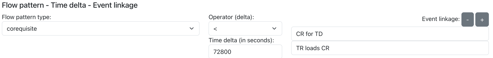

# The Object-Centric Compliance Checking Tool

## Description
The **Object-Centric Compliance Checking Tool** is a web application for the definition of object-centric compliance rules (OCCR) and the application of such rules against an object-centric event log.

The graphical interface enables users to:
- Load an object-centric event log in JSON format.
- Create and apply OCCR rules to generate matching and non-matching event sets.

## Getting Started

### Installation with Docker

#### Prerequisites
- Docker installed on your system.

#### Commands
1. Build the Docker image:
   ```bash
   docker build -t occc .
   ```
2. Run the Docker container:
   ```bash
   docker run -p 8000:8000 occc
   ```
3. Open the local application instance at:
    [http://0.0.0.0:8000/](http://0.0.0.0:8000/)

### Manual installation

#### Prerequisites
- Node.js
- Python

#### Commands
Frontend stage:

1. Install all Node.js required packages:
    ```bash
    ./frontend npm i
    ```
2. Start the frontend:
    ```bash
    ./frontend npm run dev
    ```

Backend stage:

1. Install all Python requirements:
   ```bash
   ./backend pip install -r requirements.txt
   ```
2. Run the Pyhton backend via Uvicorn:
   ```bash
   ./backend uvicorn app:app --reload 
   ```
3. Open the local application instance at:
    [http://localhost:5173/](http://localhost:5173/)

## Usage

1. First, the user must upload an Object-Centric Events Log or use a sample log from those available in the list
<br>

1. Then the user can define the OCCR by specifying its elements through the user interface
   - The first Event Pattern can be defined by choosing the event type, the eventual event’s attribute constraints, the number, and the qualifier of the event-to-object relation, the object type, and finally, the eventual object’s attribute constraints
   <br>

   - The object-centric Flow Pattern (FP) is defined with the FP name. Only for binaries FPs, the user must define also the Temporal Constraint and the Event Linkage, i.e., a list of object-to-object relations
   <br>

   - The second Event Pattern must be defined when a binary FP is chosen
   <br>

2. By clicking the “Apply” button, the OCCR will be applied to the object-centric events log, and a preview of the matching and non-matching sets will be shown for a first inspection. The user can download the sets by clicking the “Download full JSON” link
<br>